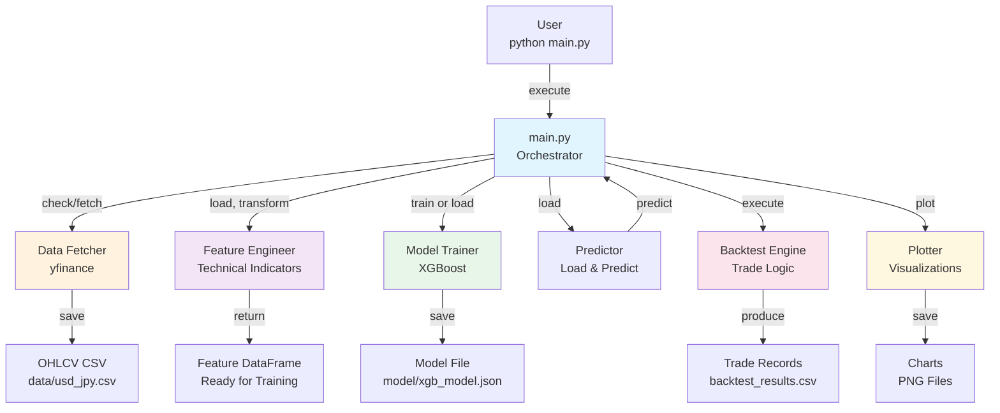
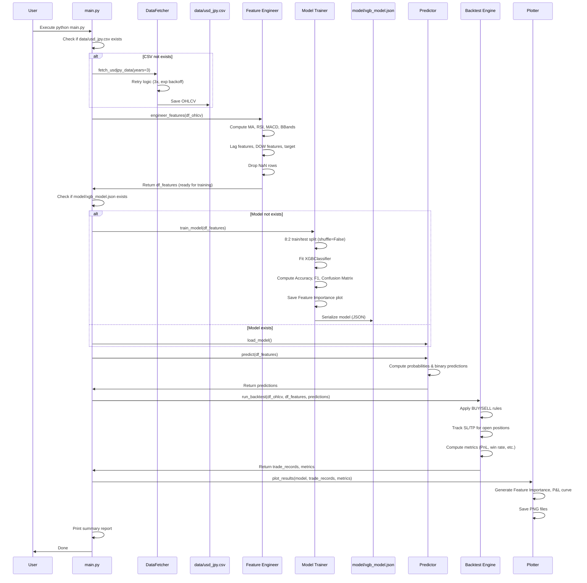
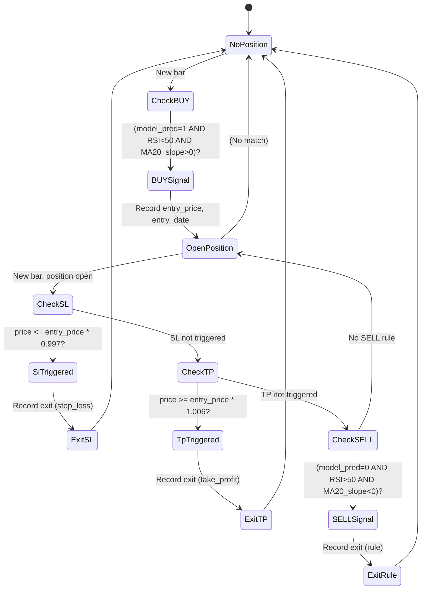

# AI USDJPY Trader — 技術設計書

## Overview

本フィーチャーは、XGBoostモデルを用いたUSJPY（ドル円）翌日方向性予測システムと、その予測に基づくルールベース売買戦略のバックテストエンジンを提供する。

**主要成果物**:
- データ取得・特徴量生成・モデル学習の完全なパイプライン
- ルールベース売買ロジック（BUY/SELL シグナル、損切り、利確）を適用したバックテストエンジン
- モデルパフォーマンスと取引結果の可視化（Feature Importance、損益曲線）

**ユーザー**: ファイナンシャルアナリスト、トレーダー、量的投資研究者が、`python main.py` 一コマンドで過去データに対する売買戦略の妥当性を検証可能。

**範囲**: グリーンフィールド実装。既存コードベース統合不要。3年間の日足USDJPY データで即座にバックテスト実行可能。

### Goals
- XGBoost分類器で翌日上昇確率を予測し、テスト精度・F1スコア・Confusion Matrix を評価
- BUY/SELLシグナル、損切り（-0.3%）、利確（+0.6%）を組み合わせた売買戦略をバックテスト
- 総損益、勝率、平均RR、シャープレシオ、最大ドローダウン等の主要メトリクスを算出・可視化
- 完全に実行可能で再現可能なコードベース（requirements.txt、.gitignore含む）

### Non-Goals
- リアルトレード執行（MT5連携は future work、スケルトンのみ）
- ハイパーパラメータ自動チューニング
- 複数通貨ペア対応
- 高頻度取引やティック単位のバックテスト

---

## Architecture

### Architecture Pattern & Boundary Map



**選択パターン**: **モジュラーパイプラインアーキテクチャ**（6つの独立モジュール）

**ドメイン境界**:
- **Data Layer**: データ取得・永続化（Data Fetcher）
- **Feature Layer**: 特徴量エンジニアリング（Feature Engineer）
- **Model Layer**: 機械学習（Model Trainer、Predictor）
- **Backtest Layer**: 売買ロジック実行（Backtest Engine）
- **Visualization Layer**: レポート生成（Plotter）
- **Orchestration Layer**: 全体フロー（main.py）

各モジュールは独立したファイルで実装され、他のモジュールとはクリーンなインターフェース（関数呼び出し、DataFrameの受け渡し）を通じてのみ連携。これにより、チーム内での並列実装が可能。

**既存パターン**: なし（グリーンフィールド）

**新規コンポーネント**: すべて新規

**ステアリング準拠**: フィーチャー実装に必要な立ち上げフェーズであり、steering が存在しないため、個別決定により推進。

---

## Technology Stack

| レイヤー | 選択 / バージョン | フィーチャーでの役割 | 備考 |
|---------|-----------------|-------------------|------|
| **Runtime** | Python 3.10+ | 実行環境 | yfinance、xgboost、ta がサポート |
| **Data Processing** | pandas 1.5+ | DataFrame操作、OHLCV管理、時系列処理 | 基本。NaN処理、resample、merge等を多用 |
| **Numerical** | numpy 1.20+ | 行列演算、統計計算（シャープレシオ等） | pandas依存 |
| **Machine Learning** | xgboost 1.7+ | 分類器（翌日上昇予測） | XGBClassifier、ハイパーパラメータ固定値 |
| **Feature Prep** | scikit-learn 1.0+ | train_test_split（8:2、shuffle=False） | 時系列対応 |
| **Data Fetch** | yfinance 0.2.32+ | USDJPY=X 日足データ取得 | リトライロジック実装必須（rate limiting対応） |
| **Technical Indicators** | ta 0.10+ | RSI, MACD, Bollinger Bands計算 | Pure Python、インストール容易 |
| **Visualization** | matplotlib 3.5+ | Feature Importance、損益曲線グラフ | PNG形式で `dpi=100` 以上 |

**dependencies 外部サービス**: yfinance (Yahoo Finance — UTC基準)

**タイムゾーン処理**: yfinance は UTC で返却。Feature Engineer は data/usd_jpy.csv ロード後、Index（日付）を UTC から JST（UTC+9）に変換して処理。バックテスト結果も JST で出力。

---

## System Flows

### メインオーケストレーションフロー



**主要な流れ**:
1. **Conditional Data Fetch**: CSV未存在なら yfinance から取得（リトライ付き）
2. **Feature Engineering**: テクニカル指標計算、NaN削除
3. **Conditional Model Training**: モデルファイル未存在なら訓練、存在なら読み込み
4. **Prediction & Backtest**: 訓練済みモデルで予測、バックテストエンジンに渡す
5. **Visualization & Report**: グラフ生成、メトリクス出力

---

### バックテストエンジンの複数終了条件フロー



**ポイント**:
- **ポジション状態**: `position_open` 変数で管理（True/False）
- **優先順位**: SL → TP → ルールベース SELL（同一バーで複数発火時、SLを先に優先）
- **トレード記録**: `entry_date, entry_price, exit_date, exit_price, return_pct, exit_reason` を記録
- **メトリクス**: 累積損益、勝率、平均RR、シャープレシオ、最大ドローダウンを計算

---

## Requirements Traceability

| 要件ID | 概要 | コンポーネント | インターフェース | フロー |
|--------|------|-------------|-----------------|-------|
| 1 | データ取得（yfinance） | Data Fetcher | Service: fetch_usdjpy_data() | Main → DataFetcher → CSV |
| 2 | 特徴量生成（MA, RSI, MACD, BBands等） | Feature Engineer | Service: engineer_features() | Main → FeatureEng → Features |
| 3 | XGBoost訓練（8:2分割、評価指標） | Model Trainer | Service: train_model() | Main → ModelTrainer → JSON + Plots |
| 4 | 予測機能（確率、バイナリ） | Predictor | Service: predict() | Main → Predictor → Predictions |
| 5 | バックテストエンジン（BUY/SELL、SL/TP） | Backtest Engine | Service: run_backtest() | Main → BacktestEng → TradeRecords + Metrics |
| 6 | 可視化（Feature Importance、P&L曲線） | Plotter | Service: plot_results() | Main → Plotter → PNG Files |
| 7 | メイン実行フロー | main.py | Script: orchestrate all steps | User → Main → All modules |
| 8 | プロジェクト構造・依存管理 | Project Setup | Files: dir structure, requirements.txt, .gitignore | Repo structure |

---

## Components and Interfaces

### Components Summary

| コンポーネント | ドメイン | 意図 | 要件カバレッジ | 依存関係 (P0/P1) | 契約 |
|-------------|---------|------|-------------|-----------------|------|
| Data Fetcher | Data | USDJPY日足データをyfinanceから取得・保存 | 1 | yfinance (P0) | Service |
| Feature Engineer | Feature | 技術指標と派生特徴量を計算し、訓練用DataFrameを生成 | 2 | pandas, ta, numpy (P0) | Service |
| Model Trainer | ML | XGBoostモデルを訓練・評価し、Feature Importanceを出力 | 3 | xgboost, sklearn (P0) | Service |
| Predictor | ML | 訓練済みモデルをロードし、新データで予測 | 4 | xgboost (P0) | Service |
| Backtest Engine | Backtest | ルールベース売買ロジックを適用し、トレード記録を生成 | 5 | pandas (P0) | Service |
| Plotter | Visualization | グラフ（Feature Importance、P&L曲線）を生成・保存 | 6 | matplotlib (P0) | Service |
| main.py | Orchestration | 全体のワークフローを制御・オーケストレート | 7 | すべてのモジュール (P0) | Script |

---

### Data Fetcher

| 項目 | 詳細 |
|------|------|
| **意図** | yfinanceを通じてUSJPY日足データ（3年分）を取得し、`data/usd_jpy.csv` に保存 |
| **要件** | 1 |
| **オーナー** | - |

**責務と制約**
- yfinance API呼び出しで USDJPY=X 日足データを取得
- 3年分のデータ（デフォルト）を取得。パラメータで変更可能
- OHLCV (Open, High, Low, Close, Volume) カラムが全て存在することを検証
- CSV ファイルを時系列順で保存（日付昇順）
- 60秒以内に完了

**依存関係**
- **外部**: yfinance — USDJPY=X データ API (P0 Criticality, rate limiting対応必須)

**契約**: Service

#### Service Interface
```python
def fetch_usdjpy_data(years: int = 3) -> pd.DataFrame:
    """
    Fetch USDJPY daily OHLCV data from yfinance.

    Args:
        years: Number of years of historical data (default 3)

    Returns:
        DataFrame with columns: Date (index), Open, High, Low, Close, Volume
        Rows are ordered chronologically (earliest to latest)

    Raises:
        YfinanceDataError: If data retrieval fails after 3 retries
        MissingColumnsError: If required OHLCV columns are missing
    """
```

**前提条件**:
- ネットワーク接続が利用可能
- yfinanceがインストール済み

**事後条件**:
- DataFrame は日付で昇順ソート済み
- すべての OHLCV カラムが存在
- `data/usd_jpy.csv` に保存済み

**不変条件**:
- データは UTC かつ日足（終値は NY市場クローズ）

**実装ノート**
- **統合**: リトライロジック（最大3回、エクスポーネンシャルバックオフ 5秒 → 10秒 → 30秒）
- **検証**: データ行数チェック（最小 750行 ≈ 3年）、OHLCV カラム存在確認
- **リスク**: yfinance のレート制限→エクスポーネンシャルバックオフで対応

---

### Feature Engineer

| 項目 | 詳細 |
|------|------|
| **意図** | OHLCV データから機械学習モデル訓練用の特徴量を生成・返却 |
| **要件** | 2 |

**責務と制約**
- yfinance（UTC）から取得した data/usd_jpy.csv の Index を JST（UTC+9）に変換
- MA5, MA20, MA50 及びそれぞれの傾き（前日比%）を計算
- RSI14 を計算
- MACD (macd, signal, histogram) を計算
- Bollinger Bands (upper, middle, lower, band_width) を計算
- 日次パーセンテージチェンジ（pct_change）を計算
- 過去5日間のラグ特徴量（lag1～lag5）を計算
- 曜日 one-hot encoding （Monday～Friday）を計算
- ターゲット変数：`target = 1 if next_close > current_close else 0` を計算
- NaN行（初期 lookback 期間）を dropna() で削除
- 訓練対応の DataFrame を返却（JST でインデックス化）

**依存関係**
- **内部**: pandas, numpy
- **外部**: ta （テクニカル指標計算, P0）

**契約**: Service

#### Service Interface
```python
def engineer_features(df_ohlcv: pd.DataFrame) -> pd.DataFrame:
    """
    Generate features from OHLCV data for model training.

    Args:
        df_ohlcv: DataFrame with Date (index), Open, High, Low, Close, Volume

    Returns:
        DataFrame with all technical indicator features and target variable.
        Rows with NaN are dropped. Ready for model training.

    Raises:
        FeatureEngineeringError: If required columns are missing
    """
```

**前提条件**:
- `df_ohlcv` は日付でインデックス化（UTC または 任意タイムゾーン）
- OHLCV すべてのカラムが存在

**事後条件**:
- NaN は存在しない（dropna済み）
- すべての特徴量カラムが存在
- `target` カラムが存在
- Index は JST（UTC+9）に変換済み

**不変条件**:
- データは時系列順を保持
- タイムゾーン は JST に統一

**実装ノート**
- **タイムゾーン変換**: `df_ohlcv.index = df_ohlcv.index.tz_localize('UTC').tz_convert('Asia/Tokyo')`
- **テクニカル指標**: ta ライブラリ使用（ta.RSI()、ta.MACD()、ta.BBANDS()）
- **NaN処理**: 初期 lookback 期間（ma50 は 50行、MACD は 34行等）を dropna() で削除（他の手法は使用しない）
- **パフォーマンス**: 750行程度のデータで 1秒以内に完了

---

### Model Trainer

| 項目 | 詳細 |
|------|------|
| **意図** | 特徴量データから XGBoost 二項分類モデルを訓練・評価 |
| **要件** | 3 |

**責務と制約**
- train/test split を 8:2 比率、shuffle=False で実施
- XGBClassifier（ハイパーパラメータ固定値）で訓練
- テスト精度、F1スコアを計算・表示
- Confusion Matrix を生成・保存
- Feature Importance を計算・グラフ保存
- 訓練済みモデルを `model/xgb_model.json` に JSON形式で保存

**依存関係**
- **内部**: pandas, numpy, scikit-learn
- **外部**: xgboost (P0)

**契約**: Service

#### Service Interface
```python
def train_model(df_features: pd.DataFrame) -> Tuple[XGBClassifier, dict]:
    """
    Train XGBoost model on feature data.

    Args:
        df_features: DataFrame with features and 'target' column

    Returns:
        (model, metrics_dict) where metrics_dict contains:
        - accuracy, f1_score, confusion_matrix
        - model is saved to model/xgb_model.json

    Raises:
        ModelTrainingError: If training fails
    """
```

**前提条件**:
- `df_features` に `target` カラムが存在
- 最小 100行のデータ

**事後条件**:
- モデルファイル保存済み
- Feature Importance グラフ生成済み
- メトリクス表示・ログ出力済み

**不変条件**:
- shuffle=False は厳密に適用

**ハイパーパラメータ** (固定値)
- n_estimators=300
- max_depth=5
- learning_rate=0.05
- subsample=0.8
- colsample_bytree=0.8

---

### Predictor

| 項目 | 詳細 |
|------|------|
| **意図** | 訓練済みモデルをロードし、新データに対して予測を実施 |
| **要件** | 4 |

**責務と制約**
- `model/xgb_model.json` から モデルをロード
- 特徴量データに対して予測確率（0～1）を計算
- バイナリ予測（閾値 0.5）を計算
- バッチ予測（複数行一度に処理）に対応
- 訓練時と同じ特徴量カラムが存在することを検証
- カラム順序を訓練時と同じに整列

**依存関係**
- **外部**: xgboost (P0)

**契約**: Service

#### Service Interface
```python
def predict(df_features: pd.DataFrame) -> pd.DataFrame:
    """
    Generate predictions using trained model.

    Args:
        df_features: DataFrame with features (without target).
                    Must contain same feature columns as training data.
                    Column order will be automatically aligned.

    Returns:
        DataFrame with columns:
        - pred_proba: Probability of upward movement (0-1)
        - pred_binary: Binary prediction (0 or 1)

    Raises:
        ModelLoadError: If model file not found
        MissingColumnsError: If required feature columns are missing
        FeatureOrderError: If feature columns cannot be aligned with training data
    """
```

**前提条件**:
- モデルファイルが存在
- `df_features` に訓練時と同じ特徴量カラムが存在（順序は問わない）
- `df_features` に NaN が存在しない

**事後条件**:
- 予測値が返却される
- 予測結果は元データと同じインデックスを持つ

**実装ノート**
- **カラム検証**: 訓練時の特徴量リストと比較し、欠落や余分なカラムをチェック
- **カラム順序**: XGBoost 要求の順序に自動的に並び替え
- **エラーハンドリング**: MissingColumnsError、FeatureOrderError は utils/errors.py で定義

---

### Backtest Engine

| 項目 | 詳細 |
|------|------|
| **意図** | ルールベース売買ロジック（BUY/SELL、SL/TP）を適用し、トレード記録を生成 |
| **要件** | 5 |

**責務と制約**
- BUY 条件を評価：`model_pred == 1 AND RSI < 50 AND MA20_slope > 0`
- SELL 条件を評価：`model_pred == 0 AND RSI > 50 AND MA20_slope < 0`
- ポジション オープン時に SL 条件を監視：`price <= entry_price * 0.997`
- ポジション オープン時に TP 条件を監視：`price >= entry_price * 1.006`
- **複数終了条件の優先順位・同時発火ロジック**：
  - 各バーで SL → TP → ルール の順で条件をチェック
  - 同一バー内で複数条件が発火した場合、最初に条件を満たしたもの（順序上）を優先
  - 例：SL と TP が同時に発火 → SL を適用し exit_reason='stop_loss' を記録
- すべてのトレード詳細を記録：日付、エントリー価格、エグジット価格、リターン%、勝敗フラグ、理由
- メトリクスを計算：総損益、勝率、平均RR、シャープレシオ、最大ドローダウン
- 損益曲線グラフを生成
- トレード記録を `backtest_results.csv` に保存

**依存関係**
- **内部**: pandas, numpy

**契約**: Service

#### Service Interface
```python
def run_backtest(
    df_ohlcv: pd.DataFrame,
    df_features: pd.DataFrame,
    predictions: pd.DataFrame
) -> Tuple[pd.DataFrame, dict]:
    """
    Run backtest with trading rules and exit conditions.

    Args:
        df_ohlcv: OHLCV data
        df_features: Feature data (for RSI, MA20_slope)
        predictions: Model predictions (pred_binary)

    Returns:
        (trade_records, metrics) where:
        - trade_records: DataFrame with all trades
        - metrics: dict with PnL, win_rate, sharpe_ratio, max_dd, etc.

    Raises:
        BacktestError: If execution fails
    """
```

**前提条件**:
- すべての入力 DataFrame が同じ長さ
- `df_features` に RSI、MA20_slope カラムが存在

**事後条件**:
- トレード記録を CSV に保存
- グラフを生成
- メトリクス計算完了

**exit_reason カラム**: 'rule', 'stop_loss', 'take_profit' のいずれか

---

### Plotter

| 項目 | 詳細 |
|------|------|
| **意図** | モデルパフォーマンスと取引結果をグラフで可視化・保存 |
| **要件** | 6 |

**責務と制約**
- Feature Importance bar chart を `model/feature_importance.png` に保存
- 累積 P&L 曲線を `backtest/pnl_curve.png` に保存
- グリッド、凡例、軸ラベルを含む
- PNG 形式、dpi >= 100

**依存関係**
- **外部**: matplotlib (P0)

**契約**: Service

#### Service Interface
```python
def plot_results(
    feature_importance: pd.Series,
    trade_records: pd.DataFrame
) -> None:
    """
    Generate and save visualization plots.

    Args:
        feature_importance: Series with feature importance values
        trade_records: DataFrame with trade records
    """
```

---

### main.py

| 項目 | 詳細 |
|------|------|
| **意図** | すべてのコンポーネントを制御し、全体ワークフローをオーケストレート |
| **要件** | 7 |

**責務と制約**
- `data/usd_jpy.csv` 存在確認 → 未存在なら Data Fetcher 実行
- Feature Engineer 実行して特徴量生成
- `model/xgb_model.json` 存在確認 → 未存在なら Model Trainer 実行
- Predictor 実行して予測
- Backtest Engine 実行
- Plotter 実行
- サマリーレポート出力
- エラー発生時は詳細ログ出力して終了

**契約**: Script

---

## Data Models

### Domain Model

取引とモデル予測が中心ドメイン。

**集約体**:
- **Trade Aggregate**: entry_date, entry_price, exit_date, exit_price, exit_reason, return_pct
  - 不変条件：entry_price > 0, exit_price > 0, exit_reason ∈ {'rule', 'stop_loss', 'take_profit'}

- **Model Prediction Aggregate**: date, pred_proba, pred_binary
  - 不変条件：pred_proba ∈ [0, 1], pred_binary ∈ {0, 1}

### Logical Data Model

**データ構造**:

#### OHLCV DataFrame
```
Index: Date (datetime)
Columns: Open (float), High (float), Low (float), Close (float), Volume (int)
```

#### Feature DataFrame
```
Index: Date (datetime)
Columns:
  - ma5, ma20, ma50 (float)
  - ma5_slope, ma20_slope, ma50_slope (float, %)
  - rsi (float, 0-100)
  - macd, macd_signal, macd_histogram (float)
  - bb_upper, bb_middle, bb_lower, bb_width (float)
  - pct_change (float, %)
  - lag1, lag2, lag3, lag4, lag5 (float)
  - mon, tue, wed, thu, fri (int, 0/1)
  - target (int, 0/1) [訓練時のみ]
```

#### Trade Records DataFrame
```
Columns:
  - entry_date (datetime)
  - entry_price (float)
  - exit_date (datetime)
  - exit_price (float)
  - return_percent (float, %)
  - win_loss (int, 1/-1)
  - cumulative_pnl (float, %)
  - exit_reason (str, 'rule'|'stop_loss'|'take_profit')
```

#### Backtest Metrics Dict
```
{
  'total_pnl': float,
  'win_rate': float (0-1),
  'num_trades': int,
  'avg_rr': float,
  'sharpe_ratio': float,
  'max_drawdown': float,
}
```

### Physical Data Model

**CSV ファイル構造**:

#### data/usd_jpy.csv
```
Date,Open,High,Low,Close,Volume
2021-01-04,103.24,103.45,103.14,103.32,1234567
...
```

#### backtest_results.csv
```
entry_date,entry_price,exit_date,exit_price,return_percent,win_loss,cumulative_pnl,exit_reason
2021-06-01,110.50,2021-06-02,110.69,0.172,1,0.172,rule
...
```

---

## Error Handling

### Error Strategy

各モジュールは `utils/errors.py` で定義されたカスタムエラーを発生させ、main.py が統一的にキャッチ・ロギング・報告する。

**カスタムエラー継承体系** (utils/errors.py):
```python
class TraderError(Exception):
    """Base exception for all trader errors"""
    def __init__(self, error_code: str, user_message: str, technical_message: str):
        self.error_code = error_code
        self.user_message = user_message  # User-friendly message
        self.technical_message = technical_message  # For logging/debugging
        super().__init__(user_message)

class DataError(TraderError):
    """Data fetch, validation, loading errors"""
    pass

class FeatureEngineeringError(TraderError):
    """Feature generation, calculation errors"""
    pass

class ModelError(TraderError):
    """Model training, loading, prediction errors"""
    pass

class BacktestError(TraderError):
    """Backtest execution, logic errors"""
    pass

class VisualizationError(TraderError):
    """Plot generation, output errors"""
    pass
```

各具体的エラー（YfinanceDataError, MissingColumnsError 等）は上記サブクラスで実装。

### Error Categories and Responses

**ユーザーエラー** (4xx 級):
- `MissingColumnsError`: 入力DataFrameにカラム不足 → ユーザーに必須カラムを列挙して通知
- `IncorrectShapeError`: データ形状が不適切 → 要求される形状をログ出力

**システムエラー** (5xx 級):
- `YfinanceDataError`: yfinance 取得失敗 → リトライ後も失敗なら、詳細なエラーと対応策を出力
- `ModelLoadError`: モデルファイル不在 → 訓練実行を案内
- `BacktestError`: バックテスト実行失敗 → スタックトレース + 直近の状態情報をログ

**ビジネスロジックエラー** (422 級):
- `NoTradesExecutedWarning`: バックテスト中にトレード実行なし → 信号条件を確認するよう通知

### Monitoring

すべてのエラーおよび主要なマイルストーン（データ取得完了、モデル訓練完了等）をログ出力。ログレベルは INFO、WARNING、ERROR を使い分け。

---

## Testing Strategy

### Unit Tests

1. **Feature Engineer**:
   - **Given**: サンプル OHLCV データ (5営業日分)
   - **When**: engineer_features() 実行
   - **Then**: MA5 = Close の5日平均、RSI ∈ [0,100] であることを検証
   - **Test**: test_ma_calculation(), test_rsi_range(), test_lag_features_offset()

2. **Model Trainer**:
   - **Given**: 訓練済みモデルと テストセット
   - **When**: evaluate_model() 実行
   - **Then**: Accuracy、F1 Score が出力され、モデルが JSON に シリアライズ可能であること
   - **Test**: test_train_test_shuffle_false(), test_model_serialization()

3. **Backtest Engine**:
   - **Given**: OHLCV + 予測 + 特徴量（RSI、MA20_slope）
   - **When**: run_backtest() 実行
   - **Then**: BUY シグナルが条件を満たす行で記録され、SL/TP がエントリー後に順序通り評価される
   - **Test**: test_buy_signal_conditions(), test_sl_tp_priority(), test_simultaneous_sl_tp()

4. **Data Fetcher**:
   - **Given**: yfinance rate limit エラー (mock)
   - **When**: fetch_usdjpy_data() 実行
   - **Then**: リトライが3回実行され、最終的に成功するか例外を発生
   - **Test**: test_retry_logic(), test_csv_chronological_order()

### Integration Tests

1. **Data Pipeline**: DataFetcher → CSV → FeatureEngineer → 完成特徴量
2. **Model Training & Prediction**: FeatureEngineer → ModelTrainer → JSON → Predictor → 予測
3. **Backtest Execution**: すべての入力を組み合わせてBacktestEngine実行 → CSV & Metrics 出力

### E2E / Full Workflow

- `python main.py` を実行 → すべてのファイル生成・完了を確認

---

## Optional Sections

### Performance & Scalability

**パフォーマンスターゲット** (要件から):
- Data Fetch: 60秒以内
- Model Training: 300秒以内（3年分日足 ～ 750行）
- Backtest Execution: 30秒以内

**スケーリング課題** (future):
- 複数通貨ペア: モジュールの参数化により対応可能
- より長期データ: pandas & xgboost は 1万行まで容易に処理可能

### Security Considerations

- **API Keys**: yfinance は認証不要（public API）
- **データ保護**: CSV ファイルは `.gitignore` で除外（個人分析用のため）
- **入出力検証**: すべてのフレームワークからの入力を型チェック

### Migration Strategy

グリーンフィールドのため、該当なし。

---

## Supporting References

なし（設計.md で自己完結）

